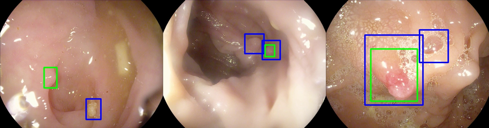
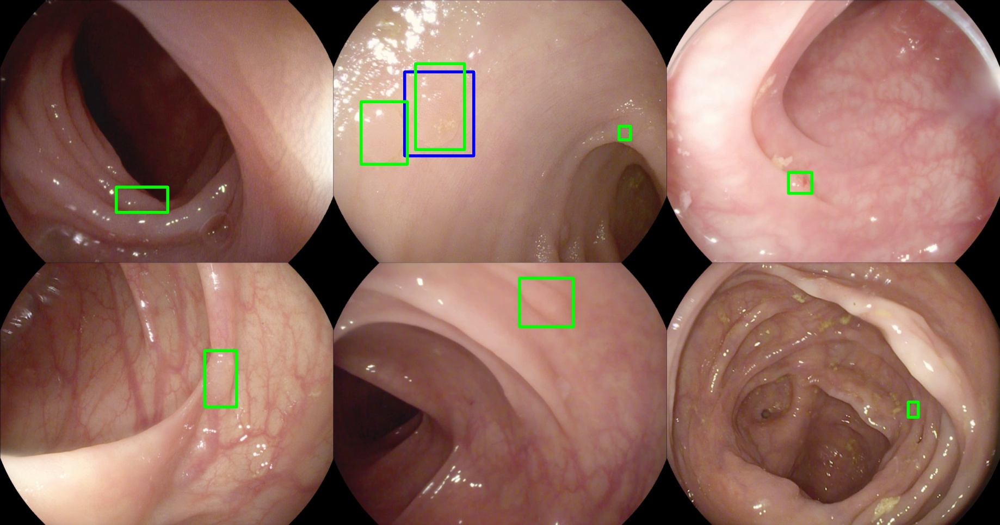

# Data Augmentation for Colon Polyp Detection: A systematic Study

## Installation

- Install Requirements
`
pip install -r requirements.txt
`
- Make sure you have configurated Tensorflow Object Detection API in your PYTHONPATH [link](https://github.com/tensorflow/models/tree/master/research/object_detection).


## Training
Download COCO Pretrained FasterRCNN weight and put into **training**
```
cd training
wget http://download.tensorflow.org/models/object_detection/faster_rcnn_resnet101_coco_2018_01_28.tar.gz
tar -zxvf faster_rcnn_resnet101_coco_2018_01_28.tar.gz
cd ..
```

You can reproduce our experiment in this study by following these instructions:
- Traditional Augmentation
```
python model_main.py --pipeline_config_path=pipeline_configs/tda.config --model_dir=checkpoint
```
- AutoAugment
```
python model_main.py  --pipeline_config_path=pipeline_configs/aa.config --model_dir=checkpoint
```

## Evaluation
To evaluate trained polyp detection model.
You need to Download [ETIS-Larib Dataset](https://polyp.grand-challenge.org/Databases/)

Extract all image to "test_images" folder before run:
```
python eval_pb.py

```

### Failed case visualization

Note: blue boxes are the predicted locations, and green boxes are groundtruths.

#### False Positive



- failed results above caused by shortcoming in bowel preparation (i.e., leftovers of food and fluid in colon)

#### False Negative



- failed results caused by the variations of polyp type and appearance (i.e., small polyp, flat polyp, similarities of polyp and colon vein)
